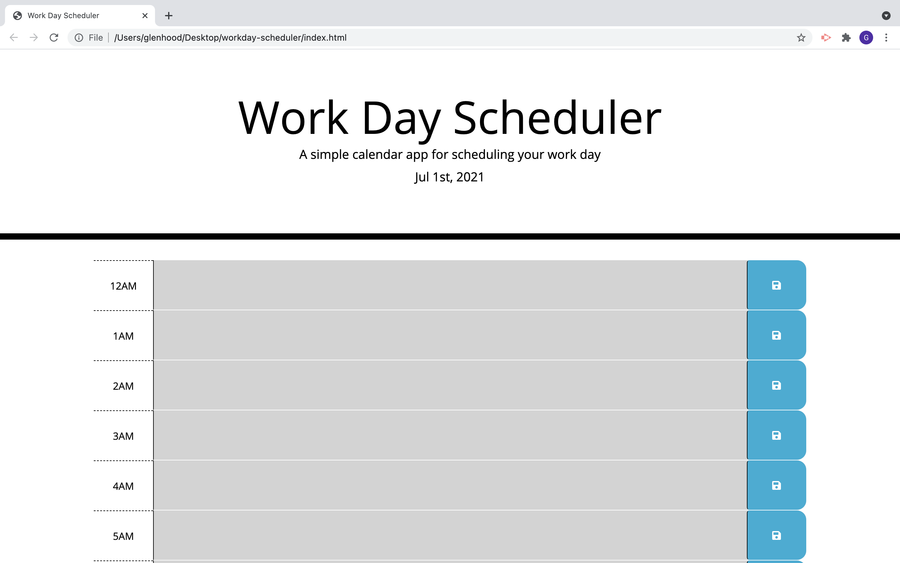

Workday Scheduler!

https://glenhood.github.io/workday-scheduler/

I created a daily planner schedule that would help an user that has a busy schedule. When the planner is opened, the current day is displayed. Time blocks are available for all of the hours of the day. The time blocks are color coded, indicating past, present, and future. When an user saves an entry by clikcing the save button, the users entry will be saved in local storage. When the user visits the page again, the entered data will remain.
   

Credits-
www.w3schools.com was used as refrence
Robert Kurle (tutor) assisted
